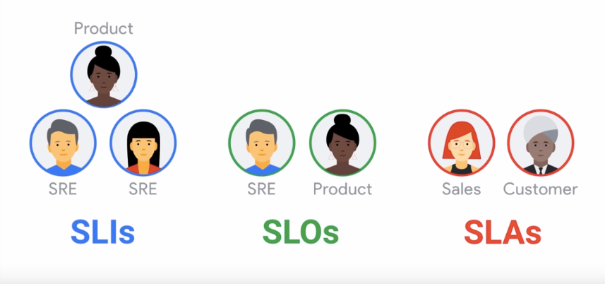

# SRE (Site Reliability Engineering)

## Service levels

### SLI (Service level indicator)
  95th percentile latency of homepage requests over past 5 minutes < 300ms

  - Request latency
  - Batch throughput
  - Failure per request

### SLO (Service level objectives)
  95th percentile homepage SLI will succeed 99.9% over trailing year

  Binding target for a collection of SLIs

### SLA (Service level agreements)
  Service credits if 95th percentile homepage SLI succeed less than 99.5% over trailing year

  - Business agreement between a customer and service provider typically based on SLOs

> SLIs drive SLOs which inform SLAs

